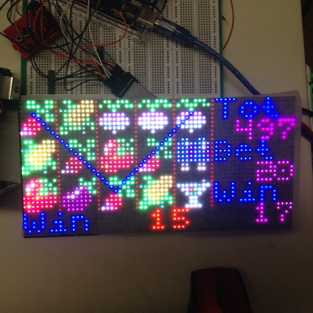

# Slot-machine
Slot machine with Arduino Mega and SMD2121 display

## Function
A slot machine based on Arduino Mega and 32x64 SMD2121 RGB LED panel as well as coin acceptor. The rules are the same
as in "Microsoft Jackpot". See instructions for paylines and symbols used. Insert a coin, then play with that money.
Project is not yet finished. Missing is still sound and some fine tune. Now I have to mount everything into a box.
I used some baking paper to smothen the symbols on the RGB panel.
If you win something, the winning paylines are displayed as in the picture:

## Design
See this video on how to configure the coin acceptor. https://www.youtube.com/watch?v=plG0ZpbN--s&t=147s
I used Piskel to design the 8x8 symbols https://www.piskelapp.com/p/agxzfnBpc2tlbC1hcHByEwsSBlBpc2tlbBiAgKDIwuvfCAw/edit
(c) Pixel Art food by Justin Cyr
You the can create C code which I converted BGR 8/8/8 bitmaps to RGB 5/6/5 used by Adafruit_GFX, as expected by the Adafruit library. (See PROGMEM_test.INO)
I used a smaller font(5x5) which is also included, to display text.
Good instructions on how to attach such an RGB Panel to an Arduino are here: https://github.com/2dom/PxMatrix

## Library used
You will need this library: https://github.com/adafruit/RGB-matrix-Panel

## Parts used
* PCB board
* Arduino Mega
* 12V 5A AC/DC Power supply
* SMD2121 32x64 RGB LED panel
* Coin acceptor
* 3 buttons

